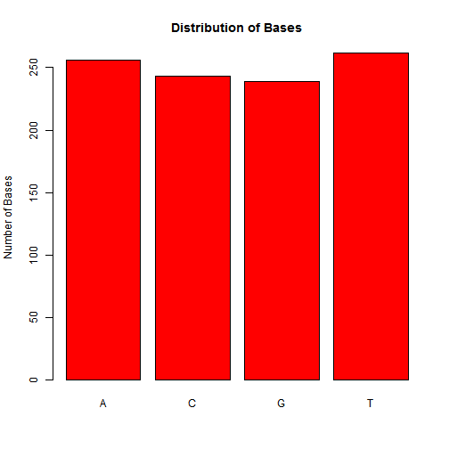

Generating Random DNA Sequences
========================================================
author: qpxu007
date: July 17, 2015
autosize: false
transition: fade

Purpose and Algorithm
========================================================

DNA consists of four type of bases (A, T, C and G). Here, we will develop a R server for generating random DNA sequences. We will generate a single strand DNA of length n with a desired base composition (i.e. percentage of pA, pT, pC, pG are given by the user).

We first use a uniform random number generator (runif) to generate a vector r of length n, then, for each r[i] value, we assign A, T, C, G the following scheme:


We calculate the basic melting temperature Tm for each sequence.

Implementation and Usage
========================================================
We developed and tested the functions (dnaseq, calTm, printDNA etc) in R first. The shiny UI app was then built on top these functions.  


 - Generating DNA sequence


```r
dna<-dnaseq(20)
printDNA(dna)
```

```
[1] "AGATCTAAGATTACCAGGCC"
```

 - Calculate Tm


```r
print(calTm(dna))
```

```
[1] 49.73
```


Plotting Actual Base Distribution
========================================================


```r
plotDNA(dnaseq(200,pcg=90))
```

 

***


```r
plotDNA(dnaseq(1000))
```

 

Deployment to the shinyapps.io Web server
========================================================

- The application is deployed to [shinyapps.io](https://qpxu007.shinyapps.io/Developing-Data-Products).

  - Slider bars are used for user inputs.

  - Inputs and results are displayed in real time.

  - The base distribution plot can be deactivated.

- User can use it to generate random DNA sequences, and explore the Tm changes with regard to GC content and length.

- Compare to other servers, e.g. [knowpapa](http://knowpapa.com/random-dna/), [ucr](http://www.faculty.ucr.edu/~mmaduro/random.htm).

- [Formula for calculating Tm](http://www.basic.northwestern.edu/biotools/oligocalc.html#helpbasic)

- [Further reading](http://www.bioinfo.de/isb/2006060024/main.html)
